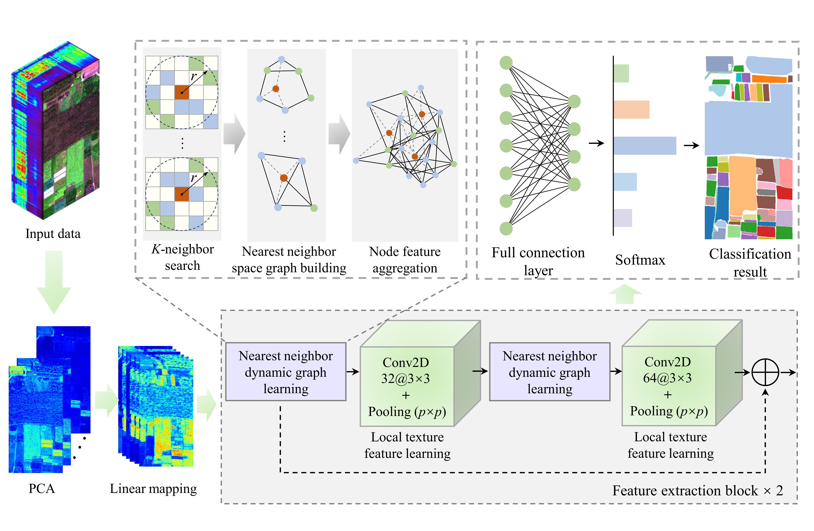

# An Efficient and Precise Dynamic Neighbor Graph Network for Crop Mapping Using Unmanned Aerial Vehicle Hyperspectral Imagery 

Tao Zhang, Chuanzhong Xuan, Yanhua Ma, Zhaohui Tang, Xinyu Gao

<div align="center">
    
</div>


## Citation
If this code is useful for your research, please cite this paper.
```

```

```


```

## Acknowledgment

This code is mainly built upon [MambaHSI](https://github.com/li-yapeng/MambaHSI) repository. We thank all the contributors for open-sourcing.

